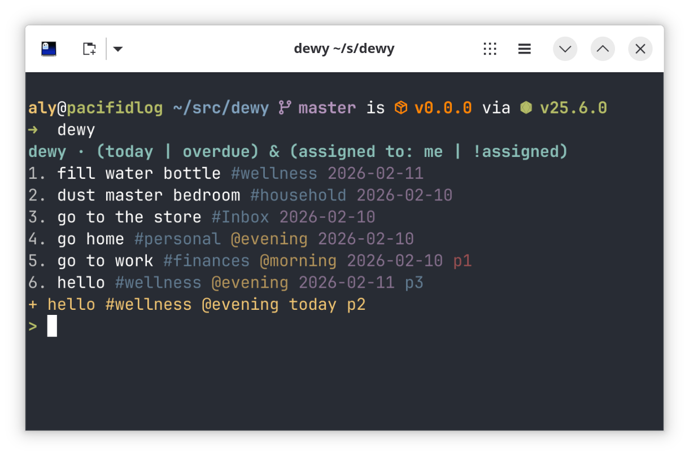

<div align="center">

# dewy

A fast, minimal TUI for Todoist built with React.js + Ink + Typescript.



</div>

## Features

- **Filter views** — browse tasks by Todoist filter queries like `today`, `overdue`, `#ProjectName`, or custom filters
- **Task editing** — edit any task's title, description, due date, priority, and labels inline
- **Quick add** — add tasks using Todoist's quick add syntax (dates, labels, projects all work)
- **Smart hints** — command suggestions appear as you type
- **XDG config** — simple JSON config at `~/.config/dewy/config.json`

## Install

```bash
npm install --global @alyraffauf/dewy
```

Or with Nix:

```bash
nix run github:alyraffauf/dewy
```

## Quick Start

1. Grab your API token from [Todoist settings](https://todoist.com/app/settings/integrations/developer)

2. Create your config file:

```bash
mkdir -p ~/.config/dewy
cat > ~/.config/dewy/config.json << 'EOF'
{
	"apiToken": "your-token-here"
}
EOF
```

3. Run it:

```bash
dewy
```

## Configuration

| Key          | Type     | Required | Description                                         |
| ------------ | -------- | -------- | --------------------------------------------------- |
| `apiToken`   | `string` | yes      | Your Todoist API token                              |
| `homeFilter` | `string` | no       | Todoist filter for the home view (default: `today`) |

## Commands

| Command          | Description                          |
| ---------------- | ------------------------------------ |
| `add <task>`     | Add a task via quick add             |
| `done <number>`  | Complete a task by its number        |
| `edit <number>`  | Edit a task's fields inline          |
| `filter <query>` | View tasks matching a Todoist filter |
| `today`          | View today's tasks                   |
| `home`           | View the home filter                 |
| `refresh`        | Reload tasks                         |
| `quit`           | Exit                                 |

## License

[GPL-3.0-or-later](LICENSE.md)
